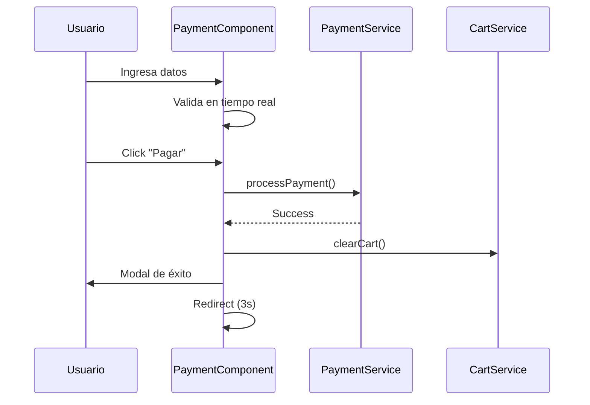

# 💳 Payment Component - Teslo Shop

## Componente de Pago Sofisticado con Validación en Tiempo Real

---

## 🎯 Características

- ✅ Validación de tarjetas con algoritmo de Luhn
- ✅ Detección automática de marca (Visa, Mastercard, Amex, Discover)
- ✅ Validación en tiempo real con feedback visual
- ✅ Sanitización de inputs para prevenir XSS
- ✅ Cálculo automático de impuestos (IVA 16%)
- ✅ Persistencia del carrito en localStorage
- ✅ Modal de éxito con ID de transacción
- ✅ Diseño responsive con DaisyUI (tema night)
- ✅ Animaciones suaves y profesionales

---

## 📦 Dependencias

```typescript
// Services
import { ProductsCartService } from '@products/services/products-cart.service';
import { PaymentService } from '@products/services/payment.service';

// Utilities
import { CardValidator } from '@shared/utils/card-validator';
import { InputSanitizer } from '@shared/utils/input-sanitizer';

// Interfaces
import { PaymentRequest, PaymentStatus } from '@shared/interfaces/payment.interface';

// Pipes
import { ProductImagePipe } from '@products/pipes/product-image.pipe';
```

---

## 🚀 Uso

### En las Rutas
```typescript
{
  path: "payment",
  title: 'Pago',
  component: PaymentComponent
}
```

### Navegación desde el Carrito
```typescript
checkout() {
  this.router.navigate(['/payment']);
}
```

---

## 🎨 Estructura del Componente

### Signals (Estado Reactivo)
```typescript
cardBrand = signal<'visa' | 'mastercard' | 'amex' | 'discover' | 'unknown'>('unknown');
isProcessing = signal(false);
paymentError = signal<string | null>(null);
showSuccess = signal(false);
```

### Computed Values
```typescript
cartProducts = this.cartService.products;
subtotal = computed(() => this.cartService.subtotal);
tax = computed(() => this.cartService.tax);
total = computed(() => this.cartService.totalWithTax);
```

### Formulario Reactivo
```typescript
paymentForm = this.fb.group({
  cardHolder: ['', [Validators.required, Validators.minLength(3), this.nameValidator]],
  cardNumber: ['', [Validators.required, this.cardNumberValidator.bind(this)]],
  expiryDate: ['', [Validators.required, this.expiryDateValidator]],
  cvv: ['', [Validators.required, this.cvvValidator.bind(this)]]
});
```

---

## 🔐 Validaciones Implementadas

### 1. Nombre del Titular
- Solo letras (incluyendo acentos y ñ)
- Mínimo 3 caracteres
- Sanitización automática

### 2. Número de Tarjeta
- Algoritmo de Luhn para validación matemática
- Detección automática de marca
- Formateo automático con espacios
- Longitud: 13-19 dígitos

### 3. Fecha de Expiración
- Formato MM/YY
- Validación de mes (01-12)
- Validación de que no esté vencida
- Formateo automático con /

### 4. CVV
- 3 dígitos para Visa/Mastercard/Discover
- 4 dígitos para American Express
- Solo números

---

## 🧪 Tarjetas de Prueba

### Válidas (Pasan Luhn Algorithm)
```
Visa:       4532015112830366
Mastercard: 5425233430109903
Amex:       374245455400126
Discover:   6011000991001201
```

### Inválidas (Para Testing)
```
1234567890123456  → Falla Luhn
4111111111111112  → Falla Luhn
```

---

## 📊 Flujo de Pago



---

## 🎨 Estilos Personalizados

### Animaciones
```css
/* Entrada suave */
:host {
  animation: fadeIn 0.5s ease-in-out;
}

/* Hover en botones */
.btn-primary:hover {
  transform: translateY(-2px);
  box-shadow: 0 0 20px rgba(34, 211, 238, 0.3);
}
```

### Scrollbar Personalizado
```css
.overflow-y-auto::-webkit-scrollbar {
  width: 6px;
}

.overflow-y-auto::-webkit-scrollbar-thumb {
  background: rgba(34, 211, 238, 0.5);
  border-radius: 3px;
}
```

---

## 🔒 Seguridad

### Sanitización de Inputs
Todos los inputs son sanitizados automáticamente:
```typescript
InputSanitizer.sanitizeString(value);      // Nombre
InputSanitizer.sanitizeCardNumber(value);  // Tarjeta
InputSanitizer.sanitizeExpiryDate(value);  // Fecha
InputSanitizer.sanitizeCVV(value);         // CVV
```

### Interceptor HTTP
El `SanitizationInterceptor` sanitiza automáticamente todas las peticiones POST/PUT/PATCH.

### Enmascaramiento
Los números de tarjeta se enmascaran en logs:
```typescript
InputSanitizer.maskCardNumber('4532015112830366');
// Output: "**** **** **** 0366"
```

---

## 📱 Responsive Design

### Breakpoints
```html
<!-- Mobile First -->
<div class="grid lg:grid-cols-3 gap-8">
  <!-- Formulario: 100% en mobile, 66% en desktop -->
  <div class="lg:col-span-2">...</div>
  
  <!-- Resumen: 100% en mobile, 33% en desktop -->
  <div class="lg:col-span-1">...</div>
</div>
```

---

## 🐛 Manejo de Errores

### Errores de Validación
```typescript
getFieldError(fieldName: string): string | null {
  const field = this.paymentForm.get(fieldName);
  
  if (!field?.touched || !field?.errors) return null;
  
  if (errors['required']) return 'Este campo es requerido';
  if (errors['invalidCard']) return 'Número de tarjeta inválido';
  // ... más validaciones
}
```

### Errores de Pago
```typescript
this.paymentService.processPayment(request).subscribe({
  next: (response) => {
    // Éxito
  },
  error: (error) => {
    this.paymentError.set(error.message);
  }
});
```

---

## 🎯 Estados del Componente

```typescript
enum PaymentStatus {
  IDLE = 'idle',           // Estado inicial
  PROCESSING = 'processing', // Procesando pago
  SUCCESS = 'success',      // Pago exitoso
  ERROR = 'error'          // Error en pago
}
```

---

## 📝 Métodos Principales

### onSubmit()
Procesa el pago cuando el formulario es válido.

### onCardNumberInput(event)
Formatea el número de tarjeta mientras se escribe.

### onExpiryInput(event)
Formatea la fecha de expiración (MM/YY).

### goBack()
Navega de vuelta al catálogo.

### getFieldError(fieldName)
Obtiene el mensaje de error para un campo específico.

---

## 🔮 Mejoras Futuras

- [ ] Integración con Stripe/PayPal
- [ ] Guardado de métodos de pago
- [ ] Soporte para múltiples monedas
- [ ] Historial de transacciones
- [ ] Facturación automática
- [ ] Cupones de descuento

---

## 📚 Referencias

- [Luhn Algorithm](https://en.wikipedia.org/wiki/Luhn_algorithm)
- [PCI DSS Compliance](https://www.pcisecuritystandards.org/)
- [Angular Reactive Forms](https://angular.dev/guide/forms/reactive-forms)
- [DaisyUI Components](https://daisyui.com/)

---

## 👥 Autores

- @TechLead - Arquitectura
- @FullStackSenior - Implementación
- @SecOps - Seguridad

---

## 📄 Licencia

Este componente es parte del proyecto Teslo Shop.
